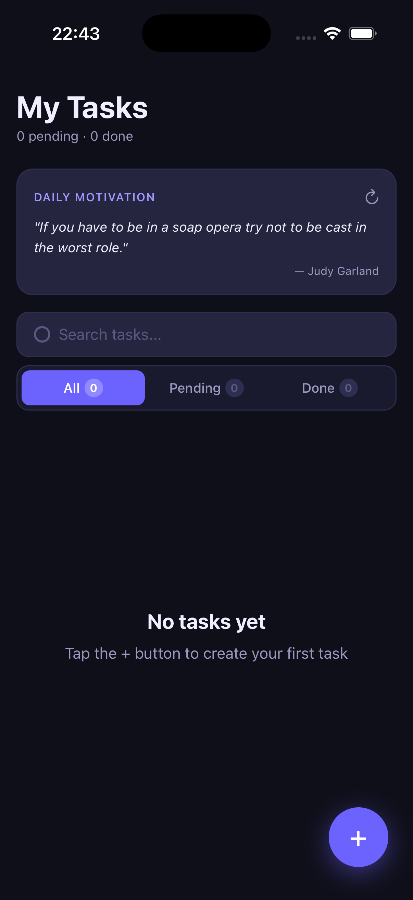
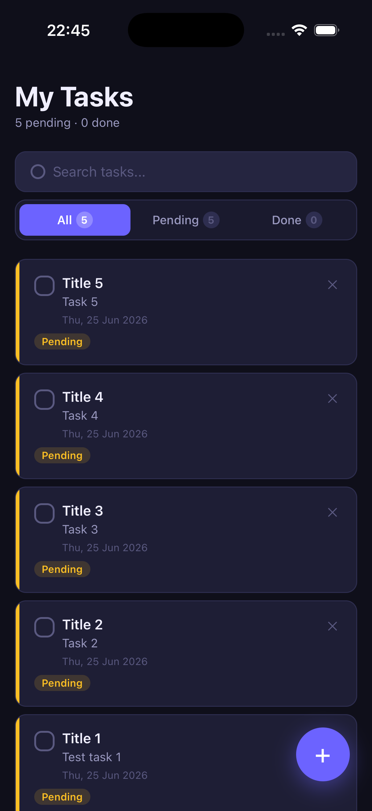
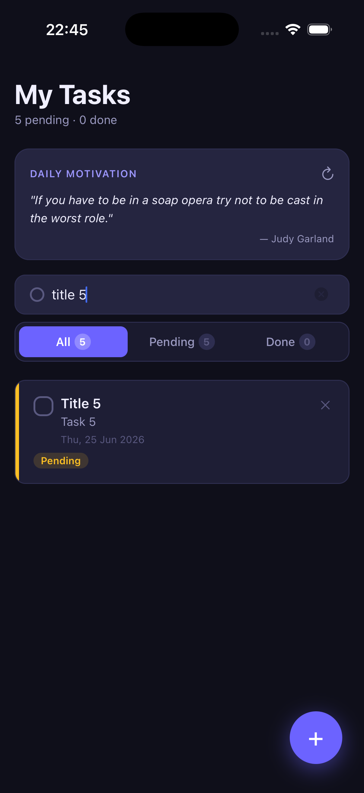
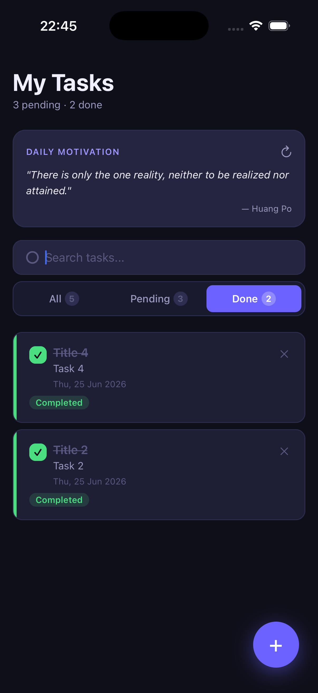
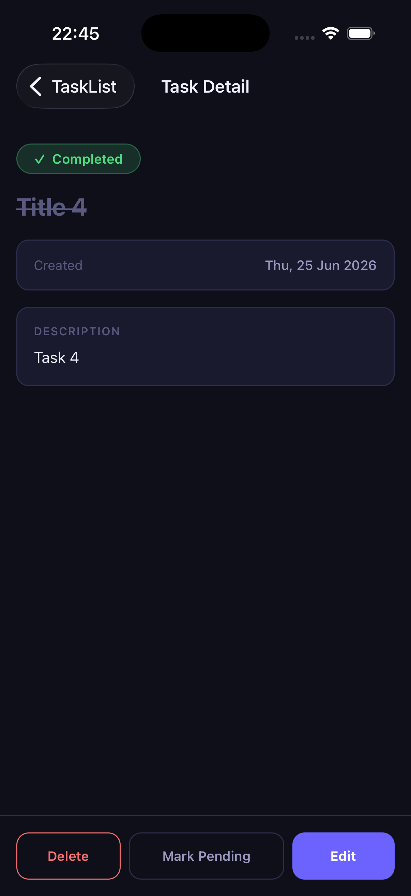
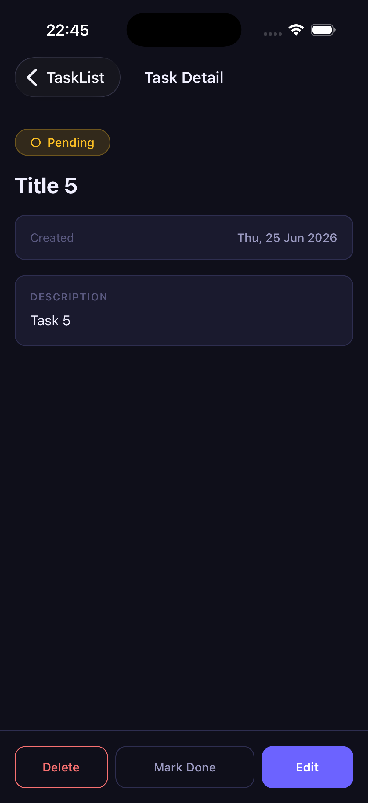

# TaskManager

A task management app built with Expo and TypeScript.

## Screenshots

<p float="left">
  
  
  
  
  
  
</p>

## Features

- **Task List** — scrollable list with status indicator bars and completion badges
- **Add Task** — form with inline validation (title required, min 3 chars, max 80; description optional, max 300)
- **Edit Task** — pre-populated edit form accessible from the detail view
- **Delete Task** — confirmation alert before deletion
- **Toggle Status** — tap checkbox on any card to mark as completed/pending
- **Task Detail** — dedicated screen showing full task info with Edit/Delete/Toggle actions
- **Search** — real-time search by task title
- **Filter tabs** — All / Pending / Done with live count badges
- **Local persistence** — tasks saved to device via AsyncStorage and reloaded on launch
- **Navigation** — native stack with modal presentation for Add/Edit screens
- **Public API** — motivational quote fetched from [Quotable API](https://api.quotable.io) on the home screen; refreshable with a tap

## Tech Stack

| Tool                                 | Purpose                                 |
| ------------------------------------ | --------------------------------------- |
| Expo SDK (blank TypeScript template) | Project scaffold & dev tooling          |
| React Native                         | Core UI framework                       |
| TypeScript                           | Type safety                             |
| React Navigation v6 (native stack)   | Screen navigation                       |
| AsyncStorage                         | Local persistence                       |
| Quotable API                         | Public motivational quote API (no auth) |
| Context + useReducer                 | Global state management                 |

## Project Structure

```
TaskManager/
├── App.tsx                        # Root — wraps app in TaskProvider
└── src/
    ├── types/index.ts             # Shared TS types
    ├── store/
    │   ├── taskReducer.ts         # Pure reducer for task state
    │   └── TaskContext.tsx        # Context provider + hooks
    ├── services/
    │   ├── storage.ts             # AsyncStorage read/write
    │   └── quoteApi.ts            # Quotable API fetch
    ├── hooks/
    │   ├── useTasks.ts            # Search + filter logic
    │   └── useQuote.ts            # API quote with loading/error
    ├── utils/
    │   ├── helpers.ts             # Date formatting, ID gen, validation
    │   └── theme.ts               # Design tokens (colors, spacing, etc.)
    ├── components/
    │   ├── TaskCard.tsx           # Task list row
    │   ├── QuoteCard.tsx          # API quote display
    │   ├── SearchBar.tsx          # Search input
    │   ├── FilterTabs.tsx         # All/Pending/Done tabs
    │   ├── EmptyState.tsx         # Context-aware empty view
    │   ├── FormInput.tsx          # Labeled input with validation
    │   └── FAB.tsx                # Floating action button
    ├── screens/
    │   ├── TaskListScreen.tsx
    │   ├── TaskDetailScreen.tsx
    │   ├── AddTaskScreen.tsx
    │   └── EditTaskScreen.tsx
    └── navigation/
        └── AppNavigator.tsx       # Stack navigator config
```

## Setup & Running

### Prerequisites

- Node.js 18+
- [Expo Go](https://expo.dev/go) app on your iOS or Android device, **or** an iOS Simulator / Android Emulator

### Steps

```bash
# 1. Clone the project, then enter the app directory
cd TaskManager

# 2. Install dependencies
npm install

# 3. Start the development server
npx expo start

# 4. Scan the QR code with Expo Go (iOS: Camera app, Android: Expo Go app)
#    Or press 'i' for iOS simulator, 'a' for Android emulator
```
